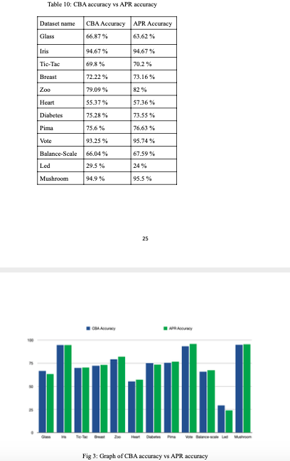

# ASSOCIATIVE-CLASSIFICATION-METHOD-BASED-ON-RULE-PRUNING-FOR-CLASSIFICATION-OF-DATASETS
A rule-based classification approach called Associative Classification (AC) normally constructs accurate classifiers from 
supervised learning data sets in data mining. It extracts "If-Then" rules, and associates with two computed parameters each 
of the generated rules; support and confidence. These two parameters are used to determine the dominance of the laws during 
the creation of a classification. In current AC algorithms, all of its corresponding training data is discarded whenever a 
rule is inserted into a classifier. The discarded data, however, are actually used to calculate support and confidence for 
other rules and will affect other lower-ranked rules, as rules normally have common examples of training data. Use static support 
and confidence will result in very large, less accurate classifiers. Therefore, it is necessary to provide a method that modifies 
the support and confidence of other rules. This paper proposes a new procedure called Active Pruning Rules (APR) to overcome the above problem, 
in order to further improve the performance of the classifiers-especially predictive accuracy and reduction of rule redundancy. 
The experimental results obtained from a variety of data sets from the University of California Irvine (UCI) and real data set for adult autism 
classification showed that APR is highly competitive with other AC and rule-based classifiers and also produces smaller and more accurate classifiers.

Results:

<h3> Average number of rules between CBA and APR </h3>

 
 <h3> Time took to build classifier for CBA and APR (in ms) </h3>
 

  
 

 
 <h3> CBA accuracy vs APR accuracy </h3>
 

  
 
 

   
 <h3> ASD dataset accuracy between CBA and APR algorithm.</h3>     
 

  
 

Quick start
-----------

cd APR

set dataset path in validation.py

python validation.py
